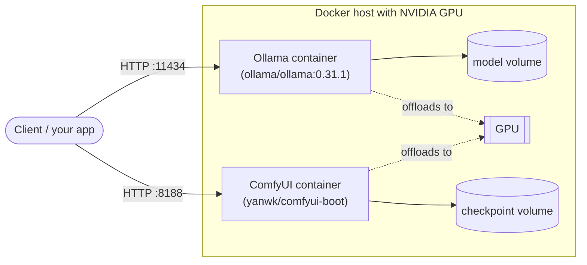

# freki-llm-stack

Self-hosted LLM inference, done properly: reproducible deployments of
open-weights models with Ollama (and vLLM, upcoming), from a single
`docker-compose up` to Kubernetes, with honest benchmarks.

## The problem

Plenty of teams want LLM capabilities but cannot — or do not want to — send
their data to an external API: confidentiality, data sovereignty, or simply
cost at scale. Running open-weights models on your own hardware solves that,
but the ecosystem is a maze of runtimes, quantization formats and GPU plumbing.

This repository is a set of **tested, reproducible recipes** to get from a
bare Linux box with an NVIDIA GPU to a working, measurable inference endpoint.

## Architecture

Two independent services, each in its own compose project: Ollama for text
models, ComfyUI for image generation. Both persist models in a named volume
and share the host's GPU.



## Quickstart

Prerequisites:

- Linux host with an NVIDIA GPU (tested: RTX 4080 16 GB, driver 595.71,
  Ubuntu 26.04)
- Docker Engine with Compose v2 (tested: Docker 29.1.3, Compose 2.40.3)
- [NVIDIA Container Toolkit](https://docs.nvidia.com/datacenter/cloud-native/container-toolkit/latest/install-guide.html)
  configured for Docker
- `curl` and `jq`

```bash
cd compose/ollama
docker compose up -d
../../scripts/smoke-test.sh
```

The smoke test waits for the API, pulls the default model (`qwen3.5:9b`,
~6 GB, first run only), sends one completion and prints the answer plus the
measured generation speed.

### Configuration

Everything is configurable through environment variables — copy
[`compose/ollama/.env.example`](compose/ollama/.env.example) to `.env` next to
the compose file and adjust:

| Variable           | Default      | Purpose                                     |
| ------------------ | ------------ | ------------------------------------------- |
| `OLLAMA_IMAGE_TAG` | `0.31.1`     | Ollama image version (pinned on purpose)    |
| `OLLAMA_HOST_PORT` | `11434`      | Host port the API is published on           |
| `OLLAMA_KEEP_ALIVE`| `5m`         | How long a model stays in VRAM when idle    |
| `OLLAMA_MODEL`     | `qwen3.5:9b` | Model exercised by the smoke test           |

## Benchmarks

Full results, hardware details and method: [`benchmarks/RESULTS.md`](benchmarks/RESULTS.md).

The harness ([`scripts/bench.sh`](scripts/bench.sh)) measures, per model:

- **Time to first token** — client-side wall clock on the streaming API
- **Generation and prompt-processing rates** in tokens/s
- **Peak VRAM and host RAM**, sampled while requests are in flight
- **Cold-load time** and how Ollama placed the model (GPU vs CPU)

over two standardized prompts (a short instruction and a ~1,200-token
document), with a warm-up plus 3 measured runs, medians reported.

Output **quality** is deliberately not scored: it belongs to the model, not
to this stack. Instead, [`benchmarks/outputs/`](benchmarks/outputs/) holds
unedited answers from every benchmarked model on seven fixed tasks
(summarization, structured extraction, coding, reasoning, trading
analysis, legal-clause extraction, RAG faithfulness), generated by
[`scripts/sample-outputs.sh`](scripts/sample-outputs.sh) for side-by-side
comparison.

Reproduce with:

```bash
./scripts/bench.sh run                # full matrix, writes benchmarks/RESULTS.md
```

| Variable            | Default          | Purpose                                |
| ------------------- | ---------------- | -------------------------------------- |
| `BENCH_MODELS`      | the 8 benchmarked | Space-separated list of models to run |
| `BENCH_RUNS`        | `3`              | Measured runs per model × scenario     |
| `BENCH_NUM_PREDICT` | `256`            | Output tokens in the generation scenario |
| `OLLAMA_URL`        | `http://localhost:11434` | API endpoint to benchmark      |

## Image generation

A second, independent stack for text-to-image models: [ComfyUI](https://github.com/comfyanonymous/ComfyUI)
via the [`yanwk/comfyui-boot`](https://github.com/YanWenKun/ComfyUI-Docker) image (no
official ComfyUI image exists; this one is actively maintained and pinned by
digest since it has no versioned releases). Benchmarked checkpoints: SDXL
Base 1.0, FLUX.1-schnell and FLUX.1-dev, all fp8/single-file, ~6.9–17.2 GB
each, ~39 GB total — all three download without a Hugging Face token.

```bash
cd compose/comfyui
docker compose up -d
../../scripts/pull-image-models.sh   # ~39 GB, first run only
```

**Licensing matters here.** SDXL Base 1.0 (CreativeML Open RAIL++-M) and
FLUX.1-schnell (Apache 2.0) are both commercially permissive. **FLUX.1-dev's
weights are licensed for non-commercial use only** — running it in a
revenue-generating production service requires a paid license from Black
Forest Labs. Its *output images*, however, are explicitly licensed for any
purpose, commercial included. Treat FLUX.1-dev here as the quality-ceiling
comparison point, not a deployment recommendation, unless you've secured
that license.

Full results: [`benchmarks/RESULTS-images.md`](benchmarks/RESULTS-images.md).
The harness ([`scripts/bench-images.sh`](scripts/bench-images.sh)) measures
time per image, images/minute, and peak VRAM/RAM, at each checkpoint's own
commonly published default steps/CFG rather than one setting forced on all
three. As with the text benchmarks, output quality is not scored — instead
[`scripts/image-gallery.sh`](scripts/image-gallery.sh) generates unedited
images from every checkpoint on four fixed prompts (photorealistic portrait,
product shot, in-image typography, a multi-subject scene with an exact
object count) into [`benchmarks/outputs/images.md`](benchmarks/outputs/images.md)
for side-by-side comparison.

```bash
./scripts/bench-images.sh run    # writes benchmarks/RESULTS-images.md
./scripts/image-gallery.sh       # writes benchmarks/outputs/images.md
```

## Roadmap

- [x] **M1** — Ollama via docker-compose, pinned versions, smoke test
- [x] **M2** — Benchmark harness: tokens/s, time-to-first-token, VRAM usage
      per model × quantization × hardware, auto-generated results table
- [ ] **M3** — vLLM alongside Ollama, same benchmarks, when-to-pick-which guide
- [ ] **M4** — Kubernetes manifests (GPU resources, model persistence)
- [ ] **M5** — Monitoring, reverse proxy with auth, sizing guide

Benchmark numbers published here will always state the exact hardware and
tool versions they were measured on.

## License

[MIT](LICENSE) — © 2026 Kouzma Petoukhov · [kaerfreki.fr](https://kaerfreki.fr)
