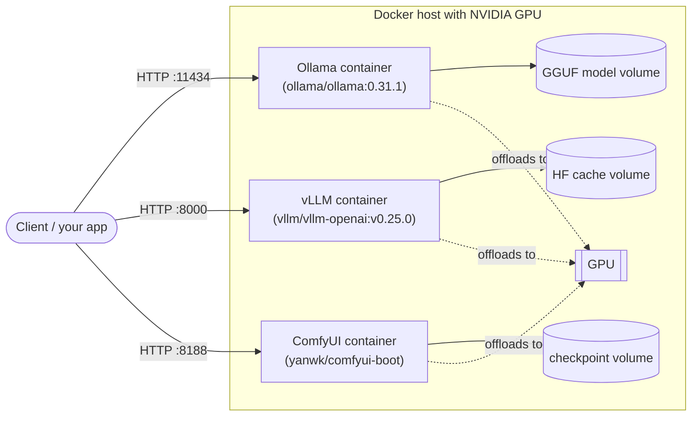

# freki-llm-stack

Self-hosted LLM inference, done properly: reproducible deployments of
open-weights models with Ollama and vLLM (and ComfyUI for images), from a
single `docker-compose up` to Kubernetes, with honest benchmarks.

## The problem

Plenty of teams want LLM capabilities but cannot — or do not want to — send
their data to an external API: confidentiality, data sovereignty, or simply
cost at scale. Running open-weights models on your own hardware solves that,
but the ecosystem is a maze of runtimes, quantization formats and GPU plumbing.

This repository is a set of **tested, reproducible recipes** to get from a
bare Linux box with an NVIDIA GPU to a working, measurable inference endpoint.

## Architecture

Three independent services, each in its own compose project: Ollama and vLLM
for text models, ComfyUI for image generation. Each persists weights in a
named volume and can claim the host's GPU (run one heavy service at a time
on a single consumer card).



## Quickstart — Ollama

Prerequisites:

- Linux host with an NVIDIA GPU (tested: RTX 4080 16 GB, driver 595.71,
  Ubuntu 26.04)
- Docker Engine with Compose v2 (tested: Docker 29.1.3, Compose 2.40.3)
- [NVIDIA Container Toolkit](https://docs.nvidia.com/datacenter/cloud-native/container-toolkit/latest/install-guide.html)
  configured for Docker
- `curl` and `jq`

```bash
cd compose/ollama
docker compose up -d
../../scripts/smoke-test.sh
```

The smoke test waits for the API, pulls the default model (`qwen3.5:9b`,
~6 GB, first run only), sends one completion and prints the answer plus the
measured generation speed.

### Ollama configuration

Copy [`compose/ollama/.env.example`](compose/ollama/.env.example) to `.env`
next to the compose file and adjust:

| Variable            | Default      | Purpose                                  |
| ------------------- | ------------ | ---------------------------------------- |
| `OLLAMA_IMAGE_TAG`  | `0.31.1`     | Ollama image version (pinned on purpose) |
| `OLLAMA_HOST_PORT`  | `11434`      | Host port the API is published on        |
| `OLLAMA_KEEP_ALIVE` | `5m`         | How long a model stays in VRAM when idle |
| `OLLAMA_MODEL`      | `qwen3.5:9b` | Model exercised by the smoke test        |

## Quickstart — vLLM

vLLM exposes an **OpenAI-compatible** API and serves **one Hugging Face model
per process**. The default model is the ~4-bit counterpart of Ollama's
`qwen3.5:4b` (`cyankiwi/Qwen3.5-4B-AWQ-INT8-INT4`) — see the
[model map](benchmarks/MODEL-MAP-vllm.md). Larger map entries (9B multimodal
AWQ, FP8, Gemma 12B) are exercised by the benchmark harness.

```bash
cd compose/vllm
docker compose up -d
../../scripts/smoke-test-vllm.sh
```

First start downloads weights into the `vllm-huggingface` volume (several
GB, can take a few minutes). The smoke test waits on `/health`, checks
`/v1/models`, then sends one `/v1/completions` request.

### vLLM configuration

Copy [`compose/vllm/.env.example`](compose/vllm/.env.example) to `.env`:

| Variable                      | Default                      | Purpose                                  |
| ----------------------------- | ---------------------------- | ---------------------------------------- |
| `VLLM_IMAGE_TAG`              | `v0.25.0`                    | Official `vllm/vllm-openai` tag (pinned) |
| `VLLM_HOST_PORT`              | `8000`                       | Host port for the OpenAI-compatible API  |
| `VLLM_MODEL`                  | `cyankiwi/Qwen3.5-4B-AWQ-INT8-INT4` | Hugging Face model id to serve    |
| `VLLM_MAX_MODEL_LEN`          | `4096`                       | Context length reserved at startup       |
| `VLLM_GPU_MEMORY_UTILIZATION` | `0.80`                       | Fraction of free VRAM vLLM may claim     |
| `VLLM_DTYPE`                  | `auto`                       | Weight dtype                             |
| `HF_TOKEN`                    | _(empty)_                    | Only needed for gated models             |

## When to pick which (Ollama vs vLLM)

| | **Ollama** | **vLLM** |
| --- | --- | --- |
| **Best for** | Local dev, many models on one box, simple ops | Production throughput, concurrent clients |
| **API** | Native `/api/*` (+ partial OpenAI compat) | OpenAI-compatible `/v1/*` |
| **Models per process** | Many — hot-swap GGUF on demand | One HF model per container |
| **Quantization** | GGUF (`Q4_K_M`, `Q8_0`, …) via `ollama pull` | AWQ / GPTQ / FP8 / BF16 from Hugging Face |
| **Strengths** | `ollama pull`, tiny ops surface, CPU offload | Continuous batching, higher multi-user tok/s |
| **Trade-offs** | Lower concurrent throughput | Heavier image, one model, HF cache |
| **Cold load** | On first request for that model | At container start (weights always resident) |

**Rule of thumb:** use **Ollama** to explore models and for single-user or
low-concurrency services; use **vLLM** when you need an OpenAI-compatible
endpoint under concurrent load and are fine pinning one model per
deployment.

Comparisons in this repo are **apples-to-apples on model family and bit-width
class**, not identical bytes: GGUF `Q4_K_M` ↔ AWQ ~4-bit, `Q8_0` ↔ FP8. Full
pairing table: [`benchmarks/MODEL-MAP-vllm.md`](benchmarks/MODEL-MAP-vllm.md).

## Benchmarks — Ollama

Full results: [`benchmarks/RESULTS.md`](benchmarks/RESULTS.md).

The harness ([`scripts/bench.sh`](scripts/bench.sh)) measures, per model:

- **Time to first token** — client-side wall clock on the streaming API
- **Generation and prompt-processing rates** in tokens/s
- **Peak VRAM and host RAM**, sampled while requests are in flight
- **Cold-load time** and how Ollama placed the model (GPU vs CPU)

over two standardized prompts (a short instruction and a ~1,200-token
document), with a warm-up plus 3 measured runs, medians reported.

Output **quality** is deliberately not scored: it belongs to the model, not
to this stack. Instead, [`benchmarks/outputs/`](benchmarks/outputs/) holds
unedited answers from every benchmarked model on seven fixed tasks
(summarization, structured extraction, coding, reasoning, trading
analysis, legal-clause extraction, RAG faithfulness), generated by
[`scripts/sample-outputs.sh`](scripts/sample-outputs.sh) for side-by-side
comparison.

```bash
./scripts/bench.sh run                # full matrix, writes benchmarks/RESULTS.md
```

| Variable            | Default                  | Purpose                                  |
| ------------------- | ------------------------ | ---------------------------------------- |
| `BENCH_MODELS`      | the 8 benchmarked        | Space-separated list of models to run    |
| `BENCH_RUNS`        | `3`                      | Measured runs per model × scenario       |
| `BENCH_NUM_PREDICT` | `256`                    | Output tokens in the generation scenario |
| `OLLAMA_URL`        | `http://localhost:11434` | API endpoint to benchmark                |

## Benchmarks — vLLM

Full results: [`benchmarks/RESULTS-vllm.md`](benchmarks/RESULTS-vllm.md)
(generated when you run the harness).

Same scenarios, same prompts, same client-side metrics as the Ollama harness,
against `/v1/completions`. Models are the HF counterparts of the Ollama
matrix ([model map](benchmarks/MODEL-MAP-vllm.md)). Each pair recreates the
compose service; cold load is wall-clock to `/health`.

Default matrix (pairs that fit an RTX 4080 16 GB at ~4-bit AWQ):

| Ollama counterpart | vLLM model |
| --- | --- |
| `qwen3.5:4b` | `cyankiwi/Qwen3.5-4B-AWQ-INT8-INT4` |
| `mistral:7b` | `solidrust/Mistral-7B-Instruct-v0.3-AWQ` |
| `llama3.1:8b` | `hugging-quants/Meta-Llama-3.1-8B-Instruct-AWQ-INT4` |
| `ornith:9b` | `cyankiwi/Ornith-1.0-9B-AWQ-INT4` |
| `qwen3.5:9b` | `sanskar003/Qwen3.5-9B-AWQ` |

Excluded from the default matrix on this host (see the model map for why):
`qwen3.5:9b-q8_0` (FP8 multimodal OOM), `gemma3:12b` (tight),
`qwen3.6:35b` (Ollama already CPU-offloads ~half).

```bash
./scripts/pull-vllm-models.sh         # cache HF weights first (recommended)
./scripts/bench-vllm.sh run           # writes benchmarks/RESULTS-vllm.md
```

The harness temporarily stops `freki-ollama` / `freki-comfyui` so VRAM
numbers are not polluted by a second resident model, then restarts them.

| Variable            | Default                         | Purpose                               |
| ------------------- | ------------------------------- | ------------------------------------- |
| `BENCH_PAIRS`       | the 7 pairs above               | `ollama_tag=hf_id` entries            |
| `BENCH_RUNS`        | `3`                             | Measured runs per model × scenario    |
| `BENCH_NUM_PREDICT` | `256`                           | Output tokens in the generation scenario |
| `VLLM_URL`          | `http://localhost:8000`         | API endpoint to benchmark             |
| `READY_TIMEOUT`     | `1200`                          | Seconds to wait for `/health` (includes first download) |

## Image generation

A separate stack for text-to-image models: [ComfyUI](https://github.com/comfyanonymous/ComfyUI)
via the [`yanwk/comfyui-boot`](https://github.com/YanWenKun/ComfyUI-Docker) image (no
official ComfyUI image exists; this one is actively maintained and pinned by
digest since it has no versioned releases). Benchmarked checkpoints: SDXL
Base 1.0, FLUX.1-schnell and FLUX.1-dev, all fp8/single-file, ~6.9–17.2 GB
each, ~39 GB total — all three download without a Hugging Face token.

```bash
cd compose/comfyui
docker compose up -d
../../scripts/pull-image-models.sh   # ~39 GB, first run only
```

**Licensing matters here.** SDXL Base 1.0 (CreativeML Open RAIL++-M) and
FLUX.1-schnell (Apache 2.0) are both commercially permissive. **FLUX.1-dev's
weights are licensed for non-commercial use only** — running it in a
revenue-generating production service requires a paid license from Black
Forest Labs. Its *output images*, however, are explicitly licensed for any
purpose, commercial included. Treat FLUX.1-dev here as the quality-ceiling
comparison point, not a deployment recommendation, unless you've secured
that license.

Full results: [`benchmarks/RESULTS-images.md`](benchmarks/RESULTS-images.md).
The harness ([`scripts/bench-images.sh`](scripts/bench-images.sh)) measures
time per image, images/minute, and peak VRAM/RAM, at each checkpoint's own
commonly published default steps/CFG rather than one setting forced on all
three. As with the text benchmarks, output quality is not scored — instead
[`scripts/image-gallery.sh`](scripts/image-gallery.sh) generates unedited
images from every checkpoint on five fixed prompts (photorealistic portrait,
product shot, in-image typography, a multi-subject scene with an exact
object count, a 4-frame game character sprite sheet) into
[`benchmarks/outputs/images.md`](benchmarks/outputs/images.md) for
side-by-side comparison.

```bash
./scripts/bench-images.sh run    # writes benchmarks/RESULTS-images.md
./scripts/image-gallery.sh       # writes benchmarks/outputs/images.md
```

## Roadmap

- [x] **M1** — Ollama via docker-compose, pinned versions, smoke test
- [x] **M2** — Benchmark harness: tokens/s, time-to-first-token, VRAM usage
      per model × quantization × hardware, auto-generated results table
- [x] **M3** — vLLM alongside Ollama, same benchmarks, when-to-pick-which guide
- [ ] **M4** — Kubernetes manifests (GPU resources, model persistence)
- [ ] **M5** — Monitoring, reverse proxy with auth, sizing guide

Benchmark numbers published here will always state the exact hardware and
tool versions they were measured on.

## License

[MIT](LICENSE) — © 2026 Kouzma Petoukhov · [kaerfreki.fr](https://kaerfreki.fr)
